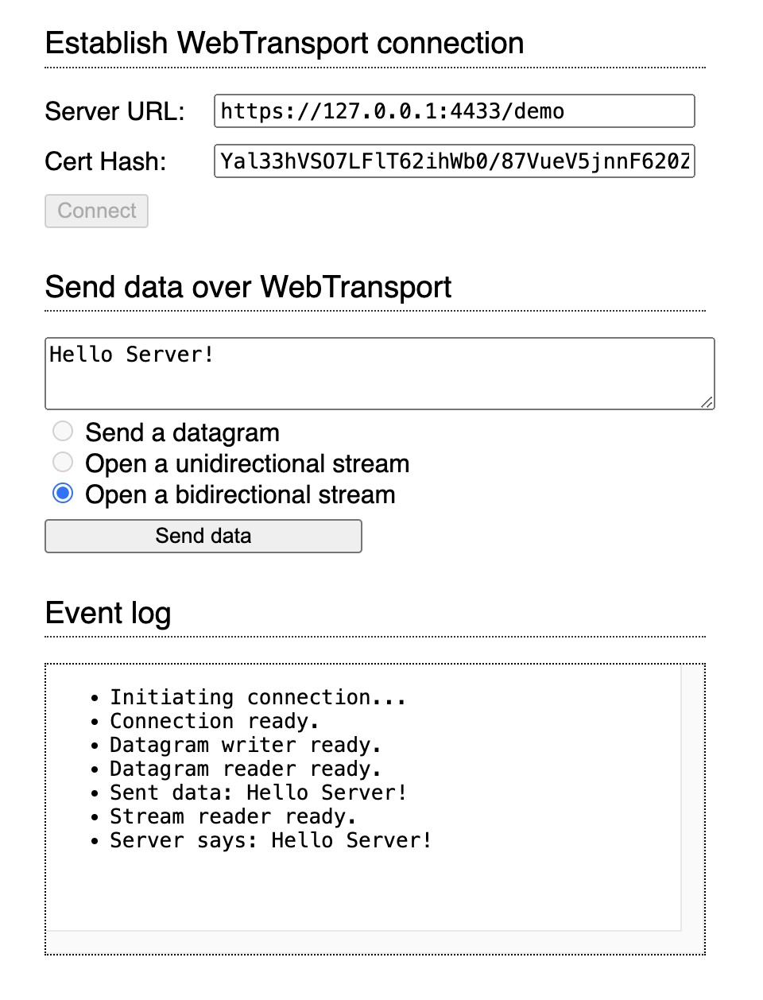

# WebTransport Demo


## Setup

1. Generate the certificate:

```
openssl req -new -newkey ec -pkeyopt ec_paramgen_curve:prime256v1 -x509 -nodes -days 10 -out certificate.pem -keyout certificate.key -subj '/CN=Test Certificate' -addext "subjectAltName = DNS:localhost"
```

2. Run the server

```
$ go run main.go

- - - - - - - - -
WebTransport Demo
- - - - - - - - -

Server Certificate Hash
Yal33hVSO7LFlT62ihWb0/87VueV5jnnF620Zt8np9s=

2024/02/01 16:36:15 listening at localhost:4433
2024/02/01 16:36:39 incoming connection...
2024/02/01 16:36:39 waiting for stream...
```

3. Open `index.html` in Chrome and connect to the server



## Main Resources

- https://github.com/adriancable/webtransport-go
- https://github.com/quic-go/webtransport-go
- https://www.w3.org/TR/webtransport/
- https://developer.mozilla.org/en-US/docs/Web/API/WebTransport/WebTransport

## Notes

1. Seems like [ppl have issues](https://github.com/quic-go/webtransport-go/issues/112) connecting WebTransport in Chrome to this webtransport-go implementation.

2. This is interesting, it's an interoperability test for webtransport-go and your local browser. https://github.com/quic-go/webtransport-go/tree/master/interop

3. Minimal browser client that can be pasted into the console:

```
// 	let transport = new WebTransport("https://localhost:4433/counter");
// 	await transport.ready;
// 	let stream = await transport.createBidirectionalStream();
// 	let encoder = new TextEncoder();
// 	let decoder = new TextDecoder();
// 	let writer = stream.writable.getWriter();
// 	let reader = stream.readable.getReader();
// 	await writer.write(encoder.encode("Hello, world!"))
// 	console.log(decoder.decode((await reader.read()).value));
// 	transport.close();
```

4. RSA certs **DO NOT WORK**:

```
openssl x509 -pubkey -noout -in certificate.pem | openssl ec -pubin -outform der | openssl dgst -sha256 -binary | base64
```

From https://www.w3.org/TR/webtransport/#web-transport-configuration: 

```
The custom certificate requirements are as follows: the certificate MUST be an X.509v3 certificate as defined in [RFC5280], the key used in the Subject Public Key field MUST be one of the allowed public key algorithms, the current time MUST be within the validity period of the certificate as defined in Section 4.1.2.5 of [RFC5280] and the total length of the validity period MUST NOT exceed two weeks. The user agent MAY impose additional implementation-defined requirements on the certificate.
```

```
The exact list of allowed public key algorithms used in the Subject Public Key Info field (and, as a consequence, in the TLS CertificateVerify message) is implementation-defined; however, it MUST include ECDSA with the secp256r1 (NIST P-256) named group ([RFC3279], Section 2.3.5; [RFC8422]) to provide an interoperable default. It MUST NOT contain RSA keys ([RFC3279], Section 2.3.1).
```

5. Chromium flag

Flags:  
`--origin-to-force-quic-on`\
`--ignore-certificate-errors-spki-list`

For MacOS run:
```
/Applications/Google\ Chrome.app/Contents/MacOS/Google\ Chrome --origin-to-force-quic-on=localhost:4433 --ignore-certificate-errors-spki-list=VKyHjJp9wvg/Rxjj7TYLw+rBbrN0DF7hXoF/ksxSg/0=
```

For any other OS see [here](https://www.chromium.org/developers/how-tos/run-chromium-with-flags/)